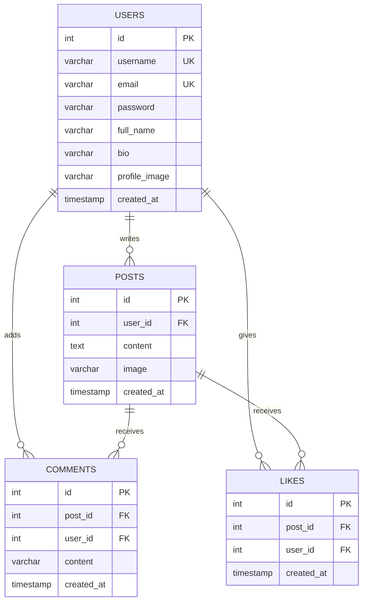

# Entity Relationship Diagram

```mermaid
erDiagram
    USERS ||--o{ POSTS : writes
    USERS ||--o{ COMMENTS : adds
    POSTS ||--o{ COMMENTS : receives
    USERS ||--o{ LIKES : gives
    POSTS ||--o{ LIKES : receives

    USERS {
        int id PK
        varchar username UK
        varchar email UK
        varchar password
        varchar full_name
        varchar bio
        varchar profile_image
        timestamp created_at
    }
    POSTS {
        int id PK
        int user_id FK
        text content
        varchar image
        timestamp created_at
    }
    COMMENTS {
        int id PK
        int post_id FK
        int user_id FK
        varchar content
        timestamp created_at
    }
    LIKES {
        int id PK
        int post_id FK
        int user_id FK
        timestamp created_at
    }
```